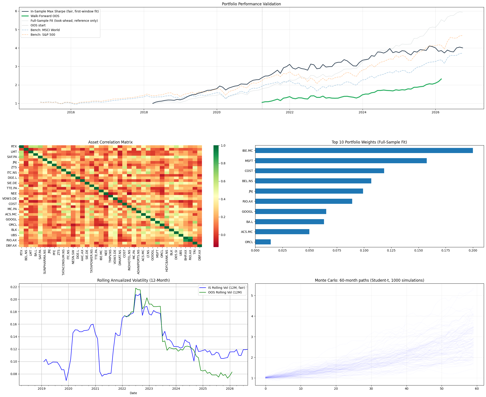

# Global Portfolio Optimization and Risk Model

A mean-variance-optimized, currency-adjusted equity portfolio spanning global sectors and markets, validated with a walk-forward out-of-sample backtest against MSCI World and S&P 500 benchmarks.

**Research question:** Can a mean-variance-optimized global equity portfolio achieve superior risk-adjusted returns relative to standard benchmarks — and does that outperformance survive genuine out-of-sample validation, or is it an artifact of in-sample overfitting?

📄 **[Read the reflection on building this →](REFLECTION.md)** — a short write-up on a look-ahead bias I found and fixed in my own backtest, and the modeling gaps that remain.

## Dashboard



*Panels: performance validation (fair in-sample vs. walk-forward out-of-sample vs. benchmarks), asset correlation matrix, top 10 portfolio weights, rolling 12-month volatility, and 1,000-path Monte Carlo projection.*

## Methodology

1. **Data & FX**: Monthly adjusted close prices (2015–present) for 39 equities across 9 currencies, converted to USD via month-end spot FX rates.
2. **Risk model**: Covariance matrix estimated via Ledoit-Wolf shrinkage.
3. **Optimization**: SLSQP maximization of Sharpe ratio, weights bounded 0–20% per position.
4. **Validation**: Rolling 36-month train / 12-month test walk-forward backtest, with a separate fair in-sample comparison fit only on the first training window (see Reflection for why this matters).
5. **Forward projection**: 1,000 simulated 60-month paths via Student-t(df=5), to reflect fat-tailed equity return behavior.
6. **Risk metrics**: Sharpe, Sortino, Calmar, max drawdown, VaR-95, CVaR-95, plus performance under three historical stress windows (COVID crash, 2022 rate shock, 2015 China devaluation).

## Limitations

- Expected returns are unshrunk (raw historical means) — the most impactful open gap; see Reflection.
- No decomposition of returns into asset-level vs. currency-level attribution.
- No transaction or rebalancing costs modeled.
- Risk-free rate held constant across an 11-year window of varying real rates.
- Ticker universe is current-day, not point-in-time (survivorship bias).
- Monte Carlo assumes i.i.d. draws — no volatility clustering or regime shifts.

This is a research/learning exercise demonstrating portfolio theory and honest out-of-sample validation methodology, not a production trading system.

## Running it

```bash
pip install -r requirements.txt
python portfolio_model.py
```

Requires internet access (pulls live data via `yfinance`). Data availability and results will vary by run date.

## Files

| File | Description |
|---|---|
| `portfolio_model.py` | Full model: data pipeline, optimization, walk-forward backtest, Monte Carlo, dashboard |
| `REFLECTION.md` | Write-up on the look-ahead bias found during development and remaining limitations |
| `outputs/dashboard.png` | Saved output of the 6-panel dashboard |
| `requirements.txt` | Python dependencies |
